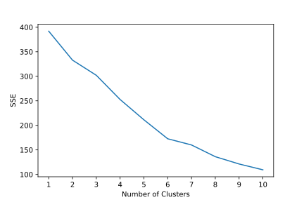
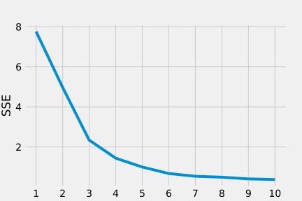
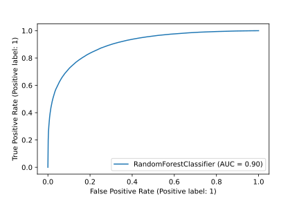

# Predicting Substance Abuse Treatment Outcomes <!-- omit in toc -->

**Team Recovery** 
Francis Ng `<chiwang@umich.edu>` 
Nicholas Dunbar `<nkdunbar@umich.edu>` 
Ricky Wong `<rckywong@umich.edu>` 
Steven Wang `<stevenzw@umich.edu>`

University of Michigan School of Information (UMSI) 
Master of Applied Data Science (MADS) 
SIADS 697 - Capstone 
Winter 2022

# Key links <!-- omit in toc -->
- [Project home](https://ricky-wong.github.io/siads697-project)
- **[Full report](https://ricky-wong.github.io/siads697-project/report)**
- [GitHub repository](https://github.com/ricky-wong/siads697-project)

# Table of Contents <!-- omit in toc -->
- [1. Introduction](#1-introduction)
  - [1.1. Background](#1-1-background)
  - [1.2. Motivation](#1-2-motivation)
  - [1.3. Data Source](#1-3-data-source)
  - [1.4. Literature Review](#1-4-literature-review)
- [2. Methodology](#2-methodology)
  - [2.1. Data Preparation](#2-1-data-preparation)
  - [2.2. Data Exploration](#2-2-data-exploration)
  - [2.3. Feature Selection for Modeling](#2-3-feature-selection-for-modeling)
  - [2.4. Dimensionality Reduction and Clustering](#2-4-dimensionality-reduction-and-clustering)
  - [2.5. Statistical Analysis](#2-5-statistical-analysis)
  - [2.6. Supervised Modeling for Completion Prediction](#2-6-supervised-modeling-for-completion-prediction)
- [3. Discussion and Results](#3-discussion-and-results)
  - [3.1. Statistical Results](#3-1-statistical-results)
  - [3.2. Implications to Treatment Providers](#3-2-implications-to-treatment-providers)
  - [3.3. Limitations](#3-3-limitations)
- [4. Conclusions](#4-conclusions)
  - [4.1. Summary of process and results](#4-1-summary-of-process-and-results)
  - [4.2. Possible future analyses](#4-2-possible-future-analyses)
  - [4.3. Ideal goals for future TEDS-D datasets](#4-3-ideal-goals-for-future-teds-d-datasets)
  - [4.4. Statements of work](#4-4-statements-of-work)
  - [4.5. Bibliography](#4-5-bibliography)

# 1. Introduction

## 1.1. Background

Substance abuse is a societal issue regularly in the news, but one whose prevalence throughout the country might still surprise many people. According to the National Center for Drug Abuse Statistics (2022), there have been over 700,000 drug overdose deaths in the United States since the year 2000. Nearly 32 million Americans have reported using illegal drugs within the last 30 days, a quarter of which meet substance abuse disorder criteria, and another nearly 15 million have an alcohol use disorder.

Billions in federal funding are used annually as part of the national drug control budget (Office of National Drug Control Policy, 2021). The most recent national drug control budget totaled a $41.0 billion investment in drug issues nationwide. The Substance Abuse and Mental Health Services Administration, a division of the Department of Health and Human Services, received only $6.6 billion of that FY 2022 federal budget for substance abuse prevention and treatment. While this is an increase over prior year’s funding, many programs still struggle to maintain care, and considerable cost is still passed on to the client.

Even with an increase in program funding due to the recent issues surrounding the opioid epidemic, many programs struggle to effectively fund programs while many patients find themselves requiring multiple courses of treatment before any significant sobriety can be found. To better understand the factors around substance abuse and recovery, research has recently begun to approach substance use disorders from a machine learning perspective. Some models have been able to successfully use certain data and cases with predictive accuracy, especially around physiological and behavioral measures that predict current substance use, but results are uneven due to insufficient data (Barenholtz, Fitzgerald, and Hahn, 2020). More efficient models might help researchers and clinicians to better identify the most efficient, effective treatments to focus on limited funding where it might provide the greatest benefit.

## 1.2. Motivation

One possible solution to the issue of insufficient data could be to use data collected from SAMHSA’s data division: the Substance Abuse & Mental Health Data Archive. SAMHDA is an initiative from the Center for Behavioral Health Statistics and Quality and works to provide data sets for analysis on a large scale, with information reporting from almost every state. Our project worked specifically with SAMHDA’s Treatment Episode Data Set: Discharges (TEDS-D), whose methodology will be discussed below.

## 1.3. Data Source

The TEDS-D dataset provided by SAMHDA provides information relating to each instance of substance abuse treatment in all reporting states, which includes variables such as demographic information, some patient substance use history, substance use at time of admission, service type at admission and discharge, and the reason for treatment discharge. These datasets are maintained by the CBHSQ, using state data submitted following the TEDS and Data Submission System user manuals available through SAMHSA.

One major consideration of the TEDS-D data is that of confidentiality protection for subjects whose information appears. Potentially identifiable information has been top or bottom coded to prevent distinguishingly high or low values, with variables recoded into categories to minimize any level of public risk. Data swapping methods are also implemented in this set to prevent potentially identifying socio-demographic characteristics.

## 1.4. Literature Review

Before we began our early exploratory data analysis, we wanted to examine the current body of literature specifically related to SAMHSA’s TEDS-D dataset. Our main plan with the dataset was to perform a wide range of analysis across states and across categories given the scope of the set, but most of the current literature focused on more specific aspects and variables. These studies gave us a bit more direction of where to look when selecting features and identifying potentially important variables when determining treatment efficacy and outcomes.

A few themes stood out when examining the most recent studies related to other TEDS-D datasets, particularly around 2015-2017 for most published studies. One main area of focus was that of the use of medication assisted treatment for opioid use disorders and its effects on treatment completion and retention. Medication assisted treatment utilizes medications paired with other traditional therapy modalities to provide a more holistic approach to substance abuse disorders. These medication-assisted treatments were found to have positive effects on both treatment completion and treatment retention (Stahler and Mennis, 2020; Askari, Martins, and Mauro, 2020), while other studies found that patients with other psychiatric comorbidities receiving such treatment were more at risk of treatment termination by their facility (Friesen and Kurdyak, 2020), possibly due to noncompliance issues related to other ongoing mental health issues.

Another main theme of recent literature looks at other demographic effects such as age and race. Race was found to affect treatment factors in numerous ways, such as increasing treatment retention for black and Hispanic patients with access to medication assisted treatment, even though those patients were less likely to have access to that care (Stahler, Mennis, and Baron, 2021). Other studies looked specifically at racial disparities in treatment for older adults and found that black adults were less likely than whites to complete treatment, while Hispanic patients were more likely (Suntai, Lee, and Leeper, 2020).

Given that the literature reviewed focused their studies on smaller subgroups of the overall TEDS-D data, we also expected the possibility of shifting focus to a smaller subgroup of the population. Even so, our exploratory analysis worked to examine the dataset as a whole to identify potential relationships ahead of any modeling.

# 2. Methodology

## 2.1. Data Preparation

As we began examining the TEDS-D 2019 dataset, there were many considerations and potential inconsistencies we needed to keep in mind based on how the data was originally collected and processed by SAMHDA. TEDS data tries to include any admissions to providers that receive public funding, but because each state decides their own provider’s TEDS eligibility, there is no independent check for that funding source. SAMHSA requests that any publicly funded facility submits treatment data to be collected, but some states are structured in a way that only clients treated with public funds are included in TEDS data. While TEDS data may be collected for many substance abuse treatment admissions, it does not include admissions to all programs nationwide. There is no consistent guideline for reporting from programs such as hospital-based treatment programs or correctional programs.

The TEDS codebook (2021) describes limitations to the data, and we should be aware of the limitations thereby imposed onto any of our interpretations. These limitations include the following:

- The clients and data reported in these records depend at least to some level on external factors, especially those related to program funding. Programs and states with higher funding could be able to provide treatment to a greater number of patients, including patients whose substance issues or financial situations might not qualify in less supported programs. As with any data around public health and potentially disadvantaged populations, we should be aware of potential underrepresentation of those populations without treatment access.
- Treatment and admission definitions can vary widely state-by-state, and as such admission numbers might not be well represented by the absolute number of events in each state.
- There is noticeable variation in the level to which states might coerce a person into treatment when criminal justice involvement is present. Some states might refer most drug cases through drug court and into treatment programs, while others might instead focus on punishing the crime rather than treating the condition.
- Individual clients cannot be followed through the dataset, as each treatment instance is reported as a separate event without any uniquely identifying information. Some states might allow for following the progress of an individual, but TEDS is currently not able to track individual progress.
- States that do not report sufficient data are not represented in the overall set. States not included in the 2019 data were Oregon, Washington, and West Virginia.

With limitations around the dataset in mind, we were then able to look more closely into the variables and information provided. Typical demographic information such as age, race, and gender is included, with a wide range of other patient information gathered at the time of admission that reflects an individual’s substance abuse history. This history can include information about previous treatment episodes, substances used and their frequencies, and typical route of consumption for any particular substance.

One area of note was in how each of these variables was represented within the dataset. As part of their cleaning process, SAMHDA encodes each variable to numeric categories, even in the case of potentially continuous variables like age, as part of their binning to deidentify any minimum or maximum values that might otherwise allow for possible identification. Missing values for each record were all coded to the value of -9 for easy identification. Variable frequencies were reported in the codebook for the entire dataset, but this is where the differences between states in reporting started to present itself as a potential issue in analysis.

## 2.2. Data Exploration

Given the potential issues of data reported on a state-by-state basis, one of our first approaches was to break down potential variables of interest on a state level across the dataset. Our first approach was to plot the breakdowns of some variable categories across all available states. Given that we were exploring the data with the intention of identifying useful outcome variables for later modeling, one variable of note was that of a patient’s reason for discharge from that particular instance of treatment. This discharge variable could include successful completion, patient drop out, facility termination of care, transfer to another program, incarceration, death, or a general ‘Other’ category.

<!-- Begin import from '../assets/completion-rates.html' -->

<!-- End import from '../assets/completion-rates.html' -->

Looking at the discharge reason variable from this perspective was helpful in highlighting something we suspected from the start: different states were potentially reporting data in an inconsistent manner. Overall, 42.1% of cases in the TEDS-D set were reported as successful completion. Some states reported rates of treatment completion much higher than would be expected from substance abuse programs, while others reported successful completion in less than 20% of their cases. Other states appeared to have almost no dropouts, replaced by facility terminations or transfers instead.

A similar approach was used to examine the breakdown of patients’ primary substance of choice when entering treatment.

<!-- Begin import from '../assets/substance-rates.html' -->

<!-- End import from '../assets/substance-rates.html' -->

Even with the wide range of substances, we can see that the most common issues across each state typically involved alcohol, heroin, or methamphetamines. If we were to instead plot the most common substance across each state, some regional patterns emerge as well:

<!-- Begin import from '../assets/most-common-primary-substance.html' -->

<!-- End import from '../assets/most-common-primary-substance.html' -->

When we see the data from a geographical perspective, we can see areas most affected by heroin or methamphetamine, with alcohol being the most reported problem across the rest of the country. Another data issue comes up too for the states where the most commonly reported primary substance is missing, when that data should be a cornerstone of treatment planning for many programs.

For a little more focused examination of some variables of interest, we also wanted to look at the potential patterns related to patient age, gender, and primary substance.

<!-- begin carousel snippet -->

<!-- end carousel snippet -->

While many of the substances tend to stay towards the middle of the overall population, we can see that marijuana use tends to skew younger, while barbiturate use skews much older. More subtle differences by gender also appear across each substance. Also of note is the stability of these patterns over other years of TEDS-D data. We considered the possibility of looking at annual differences in the provided data, but exploration showed relatively little change in patterns or reporting across recent years.

## 2.3. Feature Selection for Modeling 

The main barrier to our primary goal to generate a predictive model for treatment effectiveness or success is the absence of any true measure of that success. Subject data was gathered at their time of discharge, but there is not any sort of therapeutic score for a subject’s progress throughout treatment.

To determine an effective outcome measure, we needed to conduct further exploration into the structure of the dataset. That exploration turned out to be less effective than we initially expected. Basic demographic information such as gender, age, and marital status were recorded for us, but a significant portion of variable space consists of variables  recording yes/no type of data—about 20% of the variables overall were recorded with inconsistent scaling or binning.

Given a lack of a clear success measure, our approach started with the following possible evaluation metrics:
- The difference in substance-usage type between admission and discharge
- The contrast of substance-usage frequency

We quickly decided that only the difference in substance-usage frequency could be deemed as valid under our experimental setting. It would be hard to transform the usage-type change into an uncontroversial evaluation of ‘success,’ especially if the use of a second or a third substance does exist, or the client transferred from one kind of substance use to another. Some clinicians might argue that moving from a “harder” drug to something less offensive might constitute success, but that distinction is outside the scope of our study. Instead, we constructed the evaluation based on the usage frequency difference between admission and discharge.

Beyond the evaluation barrier, we also encountered a serious data cleaning challenge. The “missing” value (recorded as ‘-9’) constituted a non-overlapping percentage for many significant variables, resulting in the low robustness of any statistical inferences from the entire dataset. As such, we decided to run a full-scale correlation check and visualize it to determine further selection to address this problem.

The result confirmed our early hypothesis that variables have a hierarchy structure.
For prediction purposes, any variables recorded at discharge would need to be excluded. Also, variables with considerable (>10%) missing value percentages would be abandoned. These discoveries gave us further direction to dig into the dataset and address our earlier concern that data from some states could inherently contain differences. This hypothesis led to the next stage of our unsupervised clustering attempts.

## 2.4. Dimensionality Reduction and Clustering

Early PCA did not generate sufficient information to confirm our hypothesis; however, from the by-state bar chart visualization, several anomalies were spotted visually. For instance, some states have an extremely high ‘Transferred’ rate, some states have no (or next to none) ‘dropout’, some states have a high ‘Other’ rate, etc. All these traits suggest either an inconsistency in recordkeeping (or even manipulation), or vastly different facility situations than other states. Therefore, we hoped to confirm our hypothesis with some unsupervised learning clustering.

There is no truth label since we don’t know the actual clusters and if there even are clusters; we are not sure what variables are of significance at this stage. However, as the above correlation graph states, the correlation across variables shows severe and messy multicollinearity, which could explain the previous PCA results.

We took a step back to refine our problem statement. If the individual level of PCA is not achievable, what could we generate from the per-state level? We rescoped our desired outcome and decided we only needed two characteristics for the states clustering:

- Percentage of each type of discharge reason
- Total case number

We performed ETL over the dataset. First, the ‘REASON’ variable was flattened into seven features that indicate the percentage of the discharge reason within the states.
The K-Means algorithm turned out to be unfruitful when applied to the standard scaled data frame. The clustering result shows a continuous constant decrease in SSE as the cluster number increases, leading to weak converging trends.

Our solution was to apply PCA over the dataset to examine potential underlying characteristics.

The resulting graph shows a great convergence trend:

The SSE rapidly decreased until the number of clusters hit 3. We decided to start with the three-cluster setting to see if we could generate reasonable results from K-Means, the outcome of which was beyond our expectations. During the previous visualization, we spotted three states with an extremely high 'Transferred' rate: Kentucky, New Mexico, and North Carolina. Here, they all belong to the same cluster, which only contains those three states.

In addition, we have a second cluster containing the following states:

- Alaska
- District of Columbia
- Florida
- Idaho
- New Hampshire
- North Dakota
- Pennsylvania
- Virginia
- Wyoming

If we checked on those states over the previous bar chart, we could visually recognize their 'difference' from the rest of the conditions. They either have a high 'Other' records rate, drastically missing a particular reason for discharge, or have a minimal case number. If we plot the state's cluster on two-dimension PCA space, the cluster itself has a relatively clear boundary and is recognizable visually.

<!-- Begin import from '../assets/pca-cluster.html' -->
<!-- End import from '../assets/pca-cluster.html' -->

## 2.5. Statistical Analysis

Our analysis falls into the observational study domain. All datasets are prerecorded, and the records indices are organized by the case (admission registration) rather than individuals. Repetitive admission of the same individual could be reported as multiple distinct cases. By the nature of the dataset, we could not perform randomization on the individual level.

In addition, the compound variables and multicollinearity among different labels are beyond the scope of the study. Therefore we chose the diff-in-diff method as our primary and central statistical analysis approach, since it requires a minor strict condition on the exchangeability assumption.

Biases and unobserved variables are the significant barriers we encountered when conducting treatment effectiveness analysis. Specifically, we believed there might be hidden characteristics resulting in a permanent/pre-treatment difference between substance users. However, as we could safely assume that the unobserved or predetermined differences between individuals shall not change drastically after the treatment, the diff-in-diff approach provides more robust statistical inferences on the selected groups of the dataset.

We leveraged the REASON label as our treatment variable. The title records the ‘Reason for discharge,’ which has a definite integer value from 1 to 7.
All records with the ‘Treatment completed’ status, recorded as '1' under the REASON label, constitute the treatment group. All other documents are considered in the control group. We set the conditions because we either could not observe the treatment effect (in the case of ‘Transferred’ and ‘Other’), or if the treatment was interrupted for any reason. We conducted the effectiveness analysis based on the diff-in-diff setting regarding the treatment completed case in the conformity group and the rest in the control group.

## 2.6. Supervised Modeling for Completion Prediction

We carefully excluded any variable that might lead to a leakage (all variables recorded at discharge shall be viewed as such), and constructed a random forest classifier based on the data from the cluster 0 states as described above.
 
We reached an AUC of 0.9 and an accuracy of 0.82 with the vanilla setting. To address the concern of data leakage from LOS (length of stay) we ran the classifier without it, resulting in an AUC of 0.84 and an accuracy of 0.76. We could safely conclude that there is no imminent concern of the leakage from LOS; however, a relatively solid causal inference might exist between treatment completion and length of stay. In addition, we can infer that the probability that a client will complete the treatment is highly predictable with information gathered at admission. Of course, the facility might affect this rate through their different treatment methods and the length of stay. Still, we can confirm that with the LOS as an additional variable, the predictive power of the classifier increased significantly.

# 3. Discussion and Results

## 3.1. Statistical Results

The results of our diff-in-diff analysis turned out to be significant. Out of 37 states under the scope, 33 showed a significant correlation between treatment completion and substance usage decrease. Since we did not separate the treatment by service type, this general conclusion applies to all methods. 

The resulting insignificant states also concur with the underlying assumption of the diff-in-diff setting that specific frequency benchmarks must be met to produce a robust conclusion. All four states without significant correlation are states with a small case number (possibly due to population or funding).

<!-- Begin import from '../assets/p-t.html' -->
<!-- End import from '../assets/p-t.html' -->

## 3.2. Implications to Treatment Providers

When examining the implications of our model’s predictions, it becomes a bit harder to make specific recommendations to treatment providers as far as potential areas of improvement to allow for greater rates of treatment completion in patients. In the basic predictive model, nearly all the variables are data and characteristics of a patient that are already set before they ever enter treatment. 

If we drop out a patient’s length of stay we can see that the model does see a drop in predictive ability, which implies a positive correlation between longer treatment and successful completion. Aside from the specific type of treatment, length of stay is one of the only factors represented here that a facility has a measure of control over. As such, it could be beneficial for treatment programs to encourage continuation whenever a client expresses hesitation or a desire to terminate treatment.

## 3.3. Limitations

When we first started working with the TEDS-D dataset and familiarizing ourselves with the data present, it seemed like a wide range of centrally-reported data that could potentially provide highly, nationally generalizable results. Our analysis showed that this could still be true for the most part, but there were possible issues inherent to the dataset and how the records are collected. SAMHDA goes to great lengths to clean and prepare the TEDS-D datasets, but it is difficult for cleaning to address regulatory differences between states.

# 4. Conclusions

## 4.1. Summary of process and results
Given a chance to explore the data, we were able to achieve a reasonable scope of expectations for what could be achieved with the TEDS-D data. Exploratory visualizations showed us potential areas of focus and patterns within the data, especially when looking at treatment completion rate differences between states. This exploration and the potential patterns it showed were supported by further analysis, with clustering that supported our identification of possible outlier states, and a RandomForestClassifier which was able to achieve high scores of both accuracy and AUC.

## 4.2. Possible future analyses
Given the limitations inherent to the TEDS-D dataset through our analysis, as well as through SAMHDA’s logbook for the dataset, there are gaps in information that could be addressed for future collections and study. While states are required to follow submission guidelines in SAMHDA instruction manuals, there are still obvious limitations to what is generalizable across states. Definitions of what might constitute successful completion in one state might be considered a transfer of care in another, or perhaps different states are beholden to different regulations related to the funding they receive. This could explain the range of completion rates from states with near perfect completion rates versus those who barely register any completion. More specific guidelines for categorization and data cleaning from participating states could help SAMHDA to gather more widely applicable information, and could also prevent wide groupings of missing data depending on what is reported or collected at the state level.

Aside from possible future data management, examination of these treatment programs might benefit from comparison to other treatment programs that do not meet SAMHDA qualifications for TEDS-D. If similar data can be examined for programs that are privately funded, measures of efficacy and overall progress for substance abuse treatment could greatly benefit from even wider comparisons. Substance abuse is an issue whose rates have steadily increased, and examining programmatic differences between public and private funding could provide more effective use of funds in both categories. 

## 4.3. Ideal goals for future TEDS-D datasets
- More stringent submission guidelines to prevent large missing categories
- Specific guidelines as to what constitutes a certain type of treatment or type of discharge

## 4.4. Statements of work
- Nick: Data exploration, unsupervised learning, visualizations, reporting.
- Steven:  Data exploration, statistical analysis, unsupervised learning, visualizations
- Ricky: Pipeline to combine Markdown (from Google Docs) with assets (from notebook cells) to a web-ready format on GitHub Pages. All the READMEs. Repository management, testing/regression-testing/QA. Infrastructure explorations. 
- Francis: Code refactoring and optimization, data exploration, visualization. Infrastructure explorations.

## 4.5. Bibliography
Askari, M. S., Martins, S. S., & Mauro, P. M. (2020). Medication for opioid use disorder treatment and specialty outpatient substance use treatment outcomes: Differences in retention and completion among opioid-related discharges in 2016. *Journal of Substance Abuse Treatment, 114*, 108028. https://doi.org/10.1016/j.jsat.2020.108028

Barenholtz, E., Fitzgerald, N. D., & Hahn, W. E. (2020). Machine-learning approaches to substance-abuse research: Emerging trends and their implications. Current Opinion in Psychiatry, 33(4), 334–342. https://doi.org/10.1097/yco.0000000000000611

Friesen, E. L., & Kurdyak, P. (2020). The impact of psychiatric comorbidity on treatment discontinuation among individuals receiving medications for opioid use disorder. *Drug and Alcohol Dependence*, 216, 108244. https://doi.org/10.1016/j.drugalcdep.2020.108244

(2021). *National Drug Control Budget FY 2022 Funding Highlights*.

Substance Abuse and Mental Health Services Administration, Treatment Episode Data Set (TEDS) Discharges, 2019. Rockville, MD: Substance Abuse and Mental Health Services Administration, 2021.

Stahler, G. J., & Mennis, J. (2018). Treatment outcome disparities for opioid users: Are there racial and ethnic differences in treatment completion across large US metropolitan areas? *Drug and Alcohol Dependence, 190*, 170–178. https://doi.org/10.1016/j.drugalcdep.2018.06.006

Stahler, G. J., Mennis, J., & Baron, D. A. (2021). Racial/ethnic disparities in the use of medications for opioid use disorder (MOUD) and their effects on residential drug treatment outcomes in the US. *Drug and Alcohol Dependence, 226*, 108849. https://doi.org/10.1016/j.drugalcdep.2021.108849

*Substance abuse and addiction statistics [2022]*. NCDAS. (2022, April 6). Retrieved April 24, 2022, from https://drugabusestatistics.org/

Suntai, Z. D., Lee, L. H., & Leeper, J. D. (2020). Racial disparities in substance use treatment completion among older adults. *Innovation in Aging, 4*(6). https://doi.org/10.1093/geroni/igaa051 
